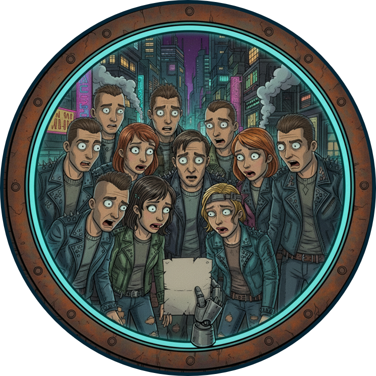

# Questionable



---
## Game Purpose
Questionable is a daily chaos generator for your Telegram group. Every day, a fresh question drops, and the poll options? The names of your own crew.
It’s messy, fun, and a little bit ruthless. Vote on who fits the question best and watch the drama unfold. Built for laughs, banter, and keeping your group on its toes :).

---

## Overview

**Questionable** consists of two main components:

1. **Question Generator** : A Python script that generates a new daily question using the **Gemini API**.  
2. **Telegram Bot** : A bot that retrieves the latest question from a **Supabase database** and publishes it as a poll in a Telegram group.

Every day, via **GitHub Actions**, the question generator runs automatically, stores the question in Supabase. Finally the Telegram bot is triggered, retrieves the question and publish it.

---

## Pipeline


---

## Prerequisites

- Python 3.10+  
- Telegram Bot Token (from [BotFather](https://t.me/botfather))  
- Supabase project with database access
- Gemini API
- Group Chat Id of your own Telegram group

---

## Supabase DB

A single table named questions with 4 columns:
- id
- question
- created_at
- context

---

## Setup

1. **Clone the repository**

```bash
git clone https://github.com/foughtmoss/questionable.git
cd questionable
