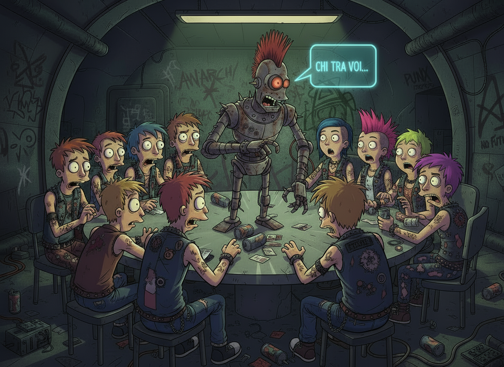

# Questionable



---

## Overview

**Questionable** is a game developed to play with friends.

It consists of two main components:

1. **Question Generator** – A Python script that generates a new daily question using the **Gemini API**.  
2. **Telegram Bot** – A bot that retrieves the latest question from a **Supabase database** and publishes it as a poll in a Telegram group.

Every day, via **GitHub Actions**, the question generator runs automatically, stores the question in Supabase, and triggers the Telegram bot to publish it.

---

## Features

- Daily automatic question generation via Gemini API  
- Storage of questions in a Supabase database  
- Telegram bot that publishes polls automatically  
- Fully automated workflow using GitHub Actions  

---

## Prerequisites

- Python 3.10+  
- Telegram Bot Token (from [BotFather](https://t.me/botfather))  
- Supabase project with database access
- Gemini API
- Group Chat Id of your own Telegram group

---

## Setup

1. **Clone the repository**

```bash
git clone https://github.com/foughtmoss/questionable.git
cd questionable
