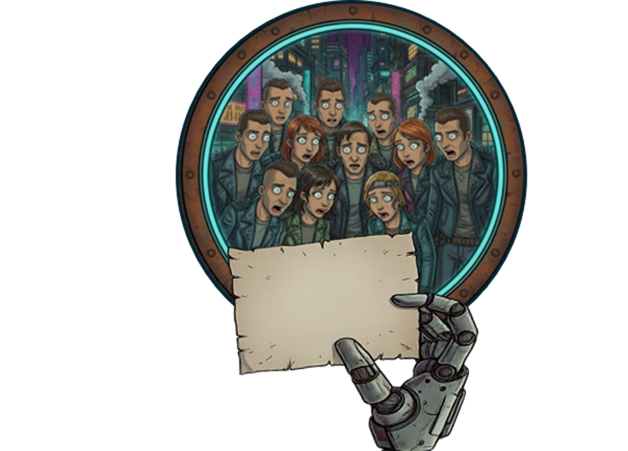
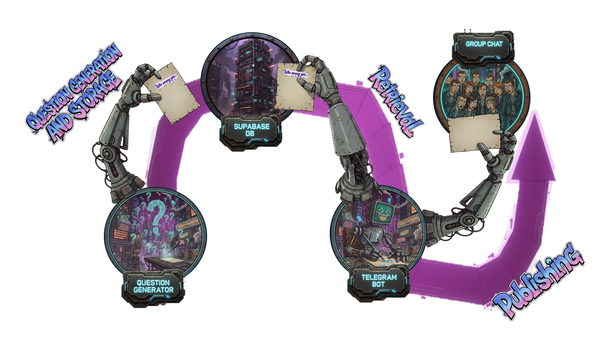

# Questionable



---
## Game Purpose
Questionable is a daily chaos generator for your Telegram group. Every day, a fresh question drops, and the poll options? The names of your own crew.
It’s messy, fun, and a little bit ruthless. Vote on who fits the question best and watch the drama unfold. Built for laughs, banter, and keeping your group on its toes :).

---

## Overview

**Questionable** is composed of two main modules:

1. **Question Generator** — a Python script that uses the **Gemini API** to create a new question every day.  
2. **Telegram Bot** — a bot that retrieves the latest question from a **Supabase** database, generates a related image using **Cloudflare Workers AI** (`@cf/leonardo/lucid-origin`), and posts it as a poll in a Telegram group.

The entire workflow is automated through **GitHub Actions**:
- The Question Generator runs daily and stores the generated question in Supabase.  
- The Telegram Bot is then triggered to retrieve the question, create a visual image from it, and publish the poll automatically.


---

## Pipeline


---

## Prerequisites
  
- Telegram Bot Token (from [BotFather](https://t.me/botfather))  
- Supabase project with database access
- Gemini API key
- Group Chat Id of your own Telegram group chat

---

## Supabase DB

A single table named questions with 4 columns:
- id
- question
- created_at
- context

---

## Build your own Questionable
Questionable was born because our group chat wanted to have fun, but without spending a single penny.
You can do the same! All the required services (GitHub, Supabase, Gemini, Cloudflare Workers AI and Telegram Bot) offer free tiers that fully cover this use case, so you can build your own Questionable!

These are the steps you have to follow:

1. Create a repository on GitHub (you can clone this repository or add each component by hand).
2. You can edit the contexts list or the model prompt in the `update_question.py` file to change language or style of the question as you like (currently the style is "simple" but you can make it "punk" or even more "family friendly").
3. Create a Telegram group chat and make anyone in the group admin.
4. Get a Google AI API key.
5. Get a Cloudflare Workers AI API token.
6. Create a Supabase Project and build the questions table as specified, you can use the `create_questions_table.txt` file content and run it in the Supabase SQL editor.
7. Create a Telegram Bot, add it to your group chat and make it admin.
8. Store the required API keys and token (look at update_question.py and bot.py) in the GitHub Secrets key section.
   (`Settings->Security->Secrets and variables->Actions->New repository secret`)
9. Now enjoy the chaos with your friends :).

---

## License

This project is licensed under the MIT License. See the [LICENSE](./LICENSE) file for details.

---

## Setup

1. **Clone the repository**

```bash
git clone https://github.com/foughtmoss/questionable.git
cd questionable
